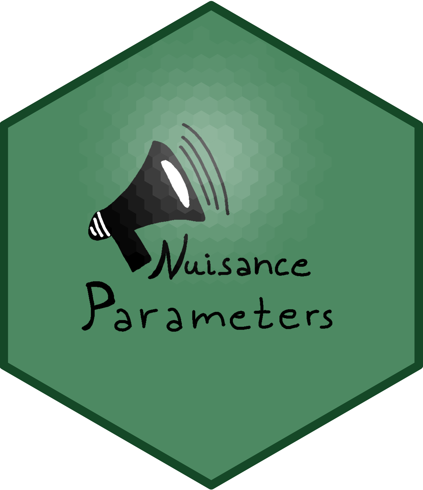
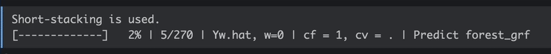
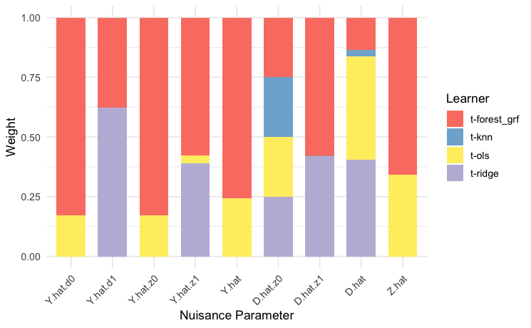
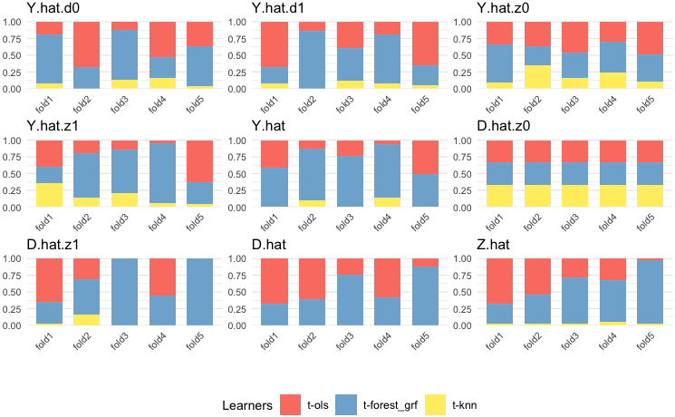
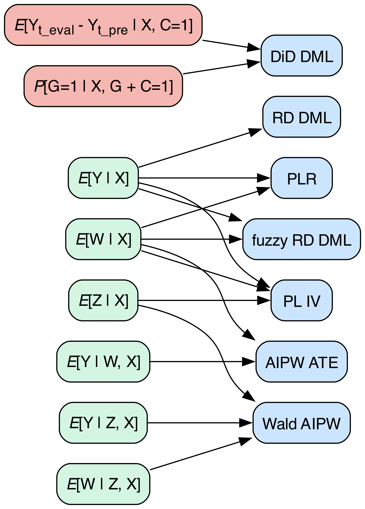

<!-- # NuisanceParameters  -->

<!-- # NuisanceParameters  -->

<!-- badges: start -->

<!-- [](https://CRAN.R-project.org/package=NuisanceParameters) -->

[](https://www.gnu.org/licenses/gpl-3.0.en.html) [](https://www.repostatus.org/#active) <!-- [](https://CRAN.R-project.org/package=NuisanceParameters) --> <!-- [](https://CRAN.R-project.org/package=NuisanceParameters) -->

<!-- badges: end -->

`NuisanceParameters` lets you estimate conditional expectations that can later be used to estimate target causal parameters of interest. A defining feature of the package is its use of supervised machine learning ("grey box") algorithms, which—following a general framework established in [Knaus (2024)](https://arxiv.org/abs/2411.11559)—have a representation as a linear combination of observed outcomes: $\hat{\tau} = \sum_{i=1}^N \omega_i Y_i$.

This package is part of an envisaged trilogy, where each package can be seamlessly integrated with the previous one but can also be used as a stand-alone unit:

1.  `NuisanceParameters` – estimates $m(X):=\mathbb{E}[Y \mid X]$, $m_w(w,X):=\mathbb{E}[Y \mid W = w, X]$, $e(X) := \mathbb{P}[W \mid X]$, etc.
2.  `MLeffects` – combines estimated nuisance parameters ($\hat{m}(X)$, $\hat{m}_w(w,X)$, $\hat{e}(X)$..) in the doubly robust (DR) score to obtain a target parameter $\tau$.
3.  `OutcomeWeights` – lets you extract the smoother matrices $\omega$ behind the nuisance and target parameters. The weights can be used to access the estimator properties or to check the covariate balance (see [Knaus, 2024](https://arxiv.org/abs/2411.11559)).

Among other features, `NuisanceParameters` offers ensemble estimation (using short and standard stacking), allows for clustering, and saves all necessary models that can be used downstream.

The package is work in progress. Find here the current state (suggestions welcome):

### In progress

-   [ ] Compatibility with [`OutcomeWeights`](https://github.com/MCKnaus/OutcomeWeights) package
    -   [x] Create a separate `get_outcome_weights` function that takes the objects produced by `nuisance_parameters` as inputs and provides the user with a list of NxN smoother matrices for all outcome regressions produced in `NuisanceParameters`, or raise a flag (e.g., for Lasso)
    -   [ ] Integrate it with `OutcomeWeights` package
-   [ ] Storage options
    -   [x] Allow the user to choose where to store the models: "No" (just the nuisance parameters in the output), "Memory" (keep all trained models in the object), or "Disk" (write them to disk).
    -   [ ] Store more efficiently: use sparse matrices or save only what's needed for `get_outcome_weights`
-   [x] Implement a progress bar
    -   {width="500"}
-   [x] Nicely display ensemble weights
    -   {width="250"} {width="250"}
-   [ ] Create vignettes
    -   [ ] General tutorial notebook
    -   [ ] Explainers for (1) different types of stacking, (2) different learners and ML methods and (3) clustering options
-   [ ] Miscellaneous and bugs to fix
    -   [ ] Fix the inability of the ensemble mechanism to work with a single `ml` method
    -   [ ] Name objects consistently throughout the package, in tune with `OutcomeWeights`
    -   [ ] Decide on whether `cf_mat` should be created internally or externally of `nuisance_parameters`

### Envisioned features

-   [ ] Hyperparameter tuning: both on the fold and in full sample
    -   [x] For `grf`'s random forest
    -   [ ] For other learners
-   [ ] Add support for more smoothers (e.g., XGBoost)
-   [ ] Add more Double ML estimators (DiD is a first priority)
-   [ ] Allow for more general treatment types
    -   [x] Binary
    -   [ ] Multivalued
    -   [ ] Continuous

Currently supported nuisance parameters and their respective target parameters:

<p align="center">



</p>

The following code shows how desired nuisance parameters can be flexibly estimated. The data was used in [Chernozhukov and Hansen (2004)](https://econpapers.repec.org/article/tprrestat/v_3a86_3ay_3a2004_3ai_3a3_3ap_3a735-751.htm), who investigated the effect of participation in the employer-sponsored 401(k) retirement savings plan (`p401`) on net assets (`net_tfa`).

``` r
if (!require("NuisanceParameters")) install.packages("NuisanceParameters", dependencies = TRUE)
library(NuisanceParameters)
library(hdm) # 401(k) dataset
library(estimatr) # lm_robust

set.seed(123)
idx <- sample(nrow(pension), size = round(0.1 * nrow(pension)))
sub <- pension[idx, ]

# subset
W <- sub$p401
Z <- sub$e401
Y <- sub$net_tfa
X <- model.matrix(~ 0 + age + db + educ + fsize + hown + inc + male + marr + pira + twoearn, 
                  data = sub)

# Cross-fitting folds and stacking type
cf = 5 
cv = 1

# Prepare the input
w_mat = prep_w_mat(W)
z_mat = prep_w_mat(Z)
cf_mat = prep_cf_mat(n=nrow(X), cf = cf, w_mat = w_mat)

ml = list(
 "ols" = create_method("ols"),
 "forest_grf" = create_method("forest_grf"),
 "knn" = create_method("knn", arguments = list("k" = 3))
)

# Core functionality of NuisanceParameters
np_short <- nuisance_parameters(NuPa = c("Y.hat","Yw.hat","Yz.hat","W.hat", "Wz.hat", "Z.hat"),
                          ml = ml, x = X, y = Y, w = W, z = Z,
                          cf_mat = cf_mat, w_mat = w_mat, z_mat = z_mat, 
                          cv = cv, learner = c("t"), 
                          storeModels = "Memory", path = NULL, quiet = TRUE)

# Produces smoother matrices for each outcome nuisance parameter
S <- NuisanceParameters::get_outcome_weights(np_object = np_short, 
                         ml = ml, 
                         x = X, y = Y, w_mat=w_mat, z_mat=z_mat,
                         cv = cv, cf_mat = cf_mat,
                         NuPa = c("Y.hat","Yw.hat","Yz.hat","W.hat", "Wz.hat", "Z.hat"),
                         quiet=TRUE)

# Check if SY = Y_hat
all.equal(all.equal(as.numeric(S$Y.hat_ml%*%Y), np_short$nuisance_parameters$Y.hat), 
          all.equal(as.numeric(S$Yw.hat_ml[[1]]%*%Y), np_short$nuisance_parameters$Yw.hat[,1]),
          all.equal(as.numeric(S$Yw.hat_ml[[2]]%*%Y), np_short$nuisance_parameters$Yw.hat[,2]),
          all.equal(as.numeric(S$Yz.hat_ml[[1]]%*%Y), np_short$nuisance_parameters$Yz.hat[,1]),
          all.equal(as.numeric(S$Yz.hat_ml[[2]]%*%Y), np_short$nuisance_parameters$Yz.hat[,2]))
```

The development version will be soon available using the `devtools` package:

``` r
library(devtools)
install_github(repo="MCKnaus/NuisanceParameters")
```

### Bug reports & support

For reporting a bug, simply [open an issue](https://github.com/stefan-1997/NuisanceParameters/issues/new) on GitHub. For personal contact, you can write an email to michael.knaus\@uni-tuebingen.de.

### References

Knaus, M. C. (2024). Treatment effect estimators as weighted outcomes, [arXiv:2411.11559](https://arxiv.org/abs/2411.11559)
