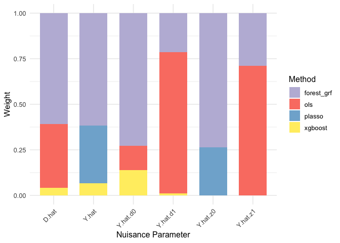

# NuisanceParameters 

<!-- # NuisanceParameters  -->

<!-- badges: start -->

<!-- [](https://CRAN.R-project.org/package=NuisanceParameters) -->

[](https://www.gnu.org/licenses/gpl-3.0.en.html)
[](https://www.repostatus.org/#active)
<!-- [](https://CRAN.R-project.org/package=NuisanceParameters) -->
<!-- [](https://CRAN.R-project.org/package=NuisanceParameters) -->

<!-- badges: end -->

`NuisanceParameters` lets you estimate conditional expectations that can
later be used to estimate target causal parameters of interest. Among
others, it is an implementation of double/debiased machine learning
framework as proposed by Chernozhukov et al. (2018).

A defining feature of the package is its use of supervised machine
learning (“grey box”) algorithms, which — following a general framework
established in [Knaus (2024)](https://arxiv.org/abs/2411.11559) — have a
representation as a linear combination of observed outcomes:
$\hat{\tau} = \sum_{i=1}^N \omega_i Y_i$. These weights can be extracted
and used in established routines for classic weighting estimators.

This package is part of an envisaged trilogy, where each package can be
seamlessly integrated with the previous one but can also be used as a
stand-alone unit:

1.  `NuisanceParameters` – flexibly estimates
    $m(X):=\mathbb{E}[Y \mid X]$,
    $m_d(d,X):=\mathbb{E}[Y \mid D = d, X]$,
    $e(X) := \mathbb{P}[D \mid X]$ and other user-specified nuisance
    parameters.
2.  `MLeffects` – combines estimated nuisance parameters ($\hat{m}(X)$,
    $\hat{m}_d(d,X)$, $\hat{e}(X)$..) in the doubly robust (DR) score to
    obtain a target parameter $\tau$.
3.  `OutcomeWeights` – lets you extract the smoother matrices $\omega$
    behind the nuisance and target parameters. The weights can be used
    to access the estimator properties or to check the covariate balance
    (see [Knaus, 2024](https://arxiv.org/abs/2411.11559)).

Among other features, `NuisanceParameters` offers ensemble estimation
(using short and standard stacking), works with binary and multivalued
treatments and allows for a rich selection of base learners.

### In progress

The package is work in progress. Find here the current state
(suggestions welcome):

- [ ] Compatibility with
  [`OutcomeWeights`](https://github.com/MCKnaus/OutcomeWeights) package
  - [x] Create a separate `get_outcome_weights` function that takes the
    objects produced by `nuisance_parameters` as inputs and provides the
    user with a list of $N \times N$ smoother matrices for all outcome
    regressions produced in `NuisanceParameters`, or raise a flag (e.g.,
    for Lasso)
  - [ ] Integrate it with `OutcomeWeights` package
- [ ] Storage options
  - [x] Allow the user to choose where to store the models: “No” (just
    the nuisance parameters in the output), “Memory” (keep all trained
    models in the object), or “Disk” (write them to disk)
  - [ ] Store more efficiently with sparse matrices
- [ ] Allow for more general treatment types
  - [x] Binary
  - [x] Multivalued
  - [ ] Continuous

### Example: financial wealth and 401(k) plan participation

The following code shows how desired nuisance parameters can be flexibly
estimated. The data was used in [Chernozhukov and Hansen
(2004)](https://econpapers.repec.org/article/tprrestat/v_3a86_3ay_3a2004_3ai_3a3_3ap_3a735-751.htm),
who investigated the effect of participation in the employer-sponsored
401(k) retirement savings plan (`p401`) on net assets (`net_tfa`).

``` r
library(NuisanceParameters)
library(hdm)

set.seed(123)
idx <- sample(nrow(pension), size = round(0.5 * nrow(pension)))
sub <- pension[idx, ]

# Find dataset description if you type ?pension in console
Y <- sub$net_tfa
D <- sub$p401
Z <- sub$e401
X <- model.matrix(~ 0 + age + db + educ + fsize + hown + inc 
                  + male + marr + pira + twoearn, data = sub)


methods = list(
 "ols" = create_method("ols"),
 "plasso" = create_method("plasso"),
 "xgboost" = create_method("xgboost"),
 "forest_grf" = create_method("forest_grf")
 )

# Core functionality 
np <- nuisance_parameters(NuPa = c("Y.hat","Y.hat.d","Y.hat.z","D.hat"),
                          X = X, Y = Y, D = D, Z = Z,
                          methods = methods, cf = 5, stacking = "short",
                          cluster = NULL, stratify = TRUE,
                          storeModels = "Memory", path = NULL, quiet = TRUE
                          )

# Estimated nuisance parameters
lapply(np$nuisance_parameters, head)
```

    ## $Y.hat
    ## [1]  6009.854 -4575.957  3437.862 14168.764  5993.148 33811.825
    ## 
    ## $Y.hat.d
    ##               0         1
    ## [1,]  1832.7005 22391.548
    ## [2,] -2039.6889 -2530.582
    ## [3,]  1096.0878 12711.518
    ## [4,] 11063.2579 34638.079
    ## [5,]   517.2776 13682.718
    ## [6,] 22420.5076 38720.661
    ## 
    ## $Y.hat.z
    ##              0         1
    ## [1,]  3536.709 16492.263
    ## [2,] -3346.530 -4988.276
    ## [3,]  1201.548 10706.441
    ## [4,] 10834.829 29859.396
    ## [5,]  1679.534 13203.072
    ## [6,] 30257.424 37035.402
    ## 
    ## $D.hat
    ## [1] 0.14332452 0.03899012 0.13601290 0.27249500 0.30314992 0.44431399
    ## 
    ## $D.hat.z
    ## [1] "This nuisance parameter was not specified and is therefore empty."
    ## 
    ## $Z.hat
    ## [1] "This nuisance parameter was not specified and is therefore empty."

``` r
# Ensemble weights
plot(np$numbers$ens_weights)
```

<!-- -->

### Learn More about `NuisanceParameters`

See our vignettes to learn more: (to be filled)

- `vignette("quick_start")` is a more detailed introduction to
  `NuisanceParameters`
- `vignette("Estimation")` is a discussion of estimation schemes
- `vignette("Multivalued")` is a discussion of multivalued treatments

### Bug reports & support

The development version will soon be available using the `devtools`
package:

``` r
library(devtools)
install_github(repo="MCKnaus/NuisanceParameters")
```

For reporting a bug, simply [open an
issue](https://github.com/stefan-1997/NuisanceParameters/issues/new) on
GitHub. For personal contact, you can write an email to
michael.knaus@uni-tuebingen.de.

### References

Knaus, M. C. (2024). Treatment effect estimators as weighted outcomes,
[arXiv:2411.11559](https://arxiv.org/abs/2411.11559)
